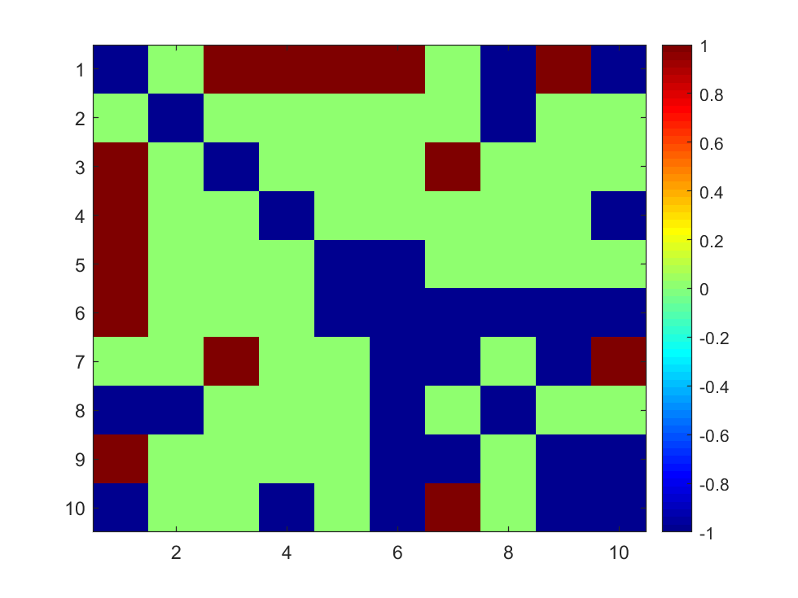
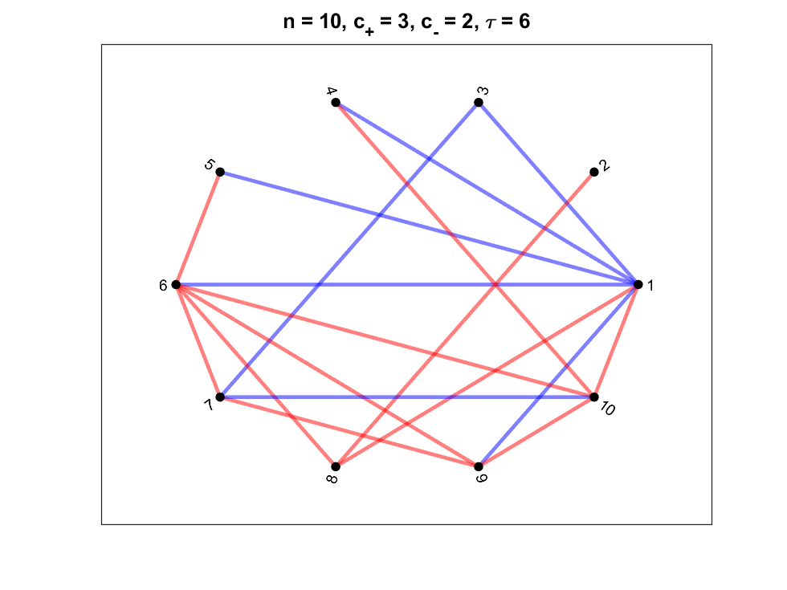
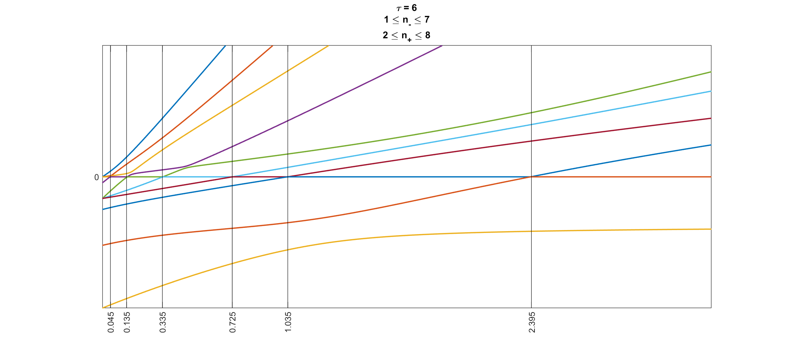

# Laplacian eigenvalue crossings

This is based on the work of Bronski and DeVille [Spectral Theory for Dynamics on Graphs containing Attractive and Repulsive Interactions, Jared Bronski and Lee DeVille, SIAM Journal of Applied Mathematics, 74 (1), 2014, pp. 83--105.] https://faculty.math.illinois.edu/~rdeville/research/91397.pdf

For a given signed graph, this code realizes all the possible spectra of Laplacians with the given graph with maximum nullity 2. Of course the ones with nullity equal to 2 are approximations.

To run the code for a graph you'll need to input the signed adjacency matrix, that is a matrix `A` with 1's and -1's for the positive and negative edges, respectively. Here is a sample:

Let's first creat a random signed graph with some edge density

    n = 10; % number of vertices
    R = rand(n,n); % a random matrix
    R = (R + R') / 2; % symmetrized
    R = R - diag(diag(R)); % get rid of the diagonal entries
    density = .6; % the edge density
    A = (R > 1 - density/2) - (R < density/2); % keeping only enough edges
    
Here `A` is a symmetric (-1,0,1)-matrix with zero diagonals. We can chech to see how it looks:

    imagesc(A)
    colormap('jet')
    colorbar
    

Then run the code:

    [E, LpLn, crossings, F] = laplacian_eigenvalue_crossings(A);
    
And here are the outputs:

As an example, if you want to find all the matrices with double zero eigenvalues in this (that's where the vertical black lines are, i.e. where the crososings happen) you can do something like this:

    LP = LpLn(:,1:size(A,1));
    LN = LpLn(:,size(A,1)+1:end);

    for t = crossings
        L = LP - t * LN;
        eig(L)
    end

Side note: In the above figure you can also see two instances of a phenomenon called "avoidance of crossing" which refers to the fact that something strange should happen for a matrix to have an eigenvalue of multiplicity 2. So, when two eigenvalues get close to each other through a perturbation, eventually they start getting far from each other without crossing each other. In the upper half plane, the purple eigenvalue avoids the orange one first, and then the green one. You can read more about it in the Linear Algebra and Its Applications book by Peter Lax.
